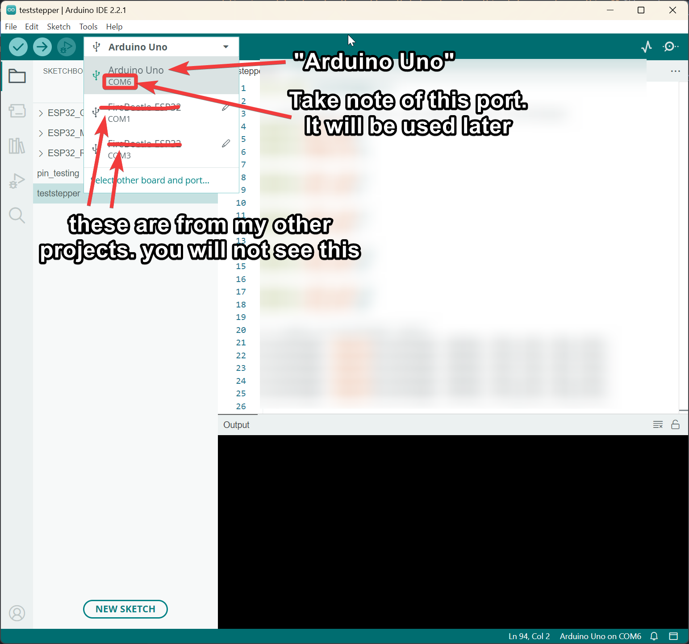
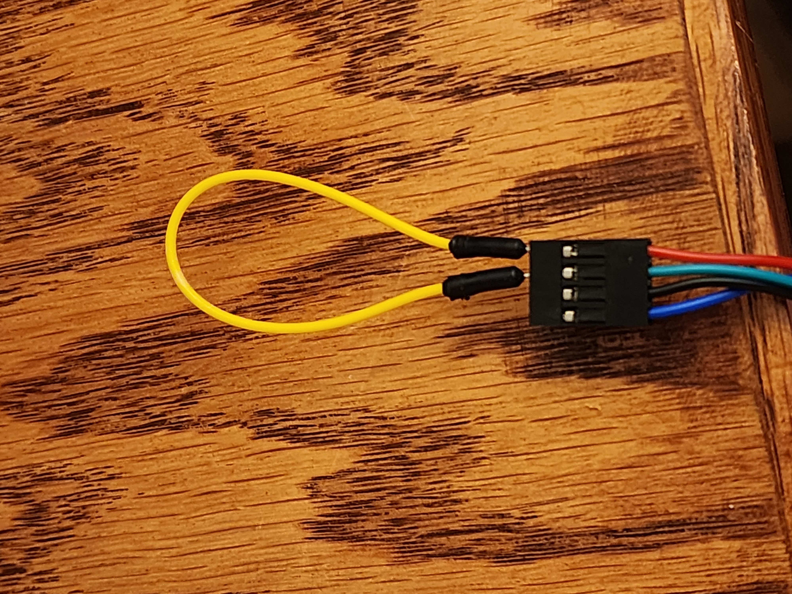

# Arduino-Powered MIDI Stepper Motor Project

## Introduction

The goal of this project is to be able to import any MIDI file in to the software of your choice, and output them to the Arduino and use the attached stepper motors to act as frequency generators for some cool music.

In case you are unfamiliar with what this project is about, [Here is a TikTok playlist of it in action](https://www.tiktok.com/@bar_low/playlist/Motor%20Music-7299252254878583598)

## Prerequisites

Please read the entire tutorial before starting this project. You should also have a basic understanding of MIDI files and how they work. If you do not, I would recommend watching [this YouTube video](https://youtu.be/faZIkN_e_1s) before continuing.

This project requires some advanced understanding of electronics. You should be familiar with the Arduino board and how to upload sketches to it. You should also be familiar with basic Python programming and how to install Python libraries. The most complex thing will be troubleshooting motor issues (this is explained further in the troubleshooting section).
Do consider you may encounter problems that require you to search for solutions online. This project costs roughly $60-$70 to complete if you have none of the parts. You can find the parts list below.
This tutorial is for 4 motors but you can use as many as your microcontroller (the Arduino Duo in this case) supports. Each extra motor requires a minimum of 2 digitalOutput pins on the Arduino.

This project also requires the use of a DAW(Digital Audio Workstation) to convert the MIDI files to a format that can be used by the Python script. I used FL Studio for this but you can use any DAW **as long as you are able to output to a single MIDI port, with many MIDI channels**.

I have noted individual parts of the instructions that may be difficult to understand or may require some extra research. **I would very highly recommend figuring out how to solve the problems that do not cost anything before you buy anything.** It's much easier to bail on a project if you've not spent any money on it. The amazon links are affiliate links and I will get a small commission if you purchase through them. That being said, if you are able to find the same parts for cheaper elsewhere I would recommend doing that.

## Materials Needed

- [Arduino Duo](https://amzn.to/3ucQLEB)
- [Arduino CNC Shield](https://amzn.to/3swZSQ0) This comes with drivers so you do not have to purchase them separately.
- [NEMA 17 Stepper Motors (this link is a 5 pack for the best price)](https://amzn.to/3SEyPwC)
- [Driver modules for stepper motors (A4988 are good because they are loud)](https://amzn.to/3QQbbvP) You do not need this if you buy the CNC shield above, they are included with that.
- Paperclip or an electrical test lead - This is used to test the polarity of the motors
- [12V Power Supply](https://amzn.to/3SDBPJQ)
- Wires to plug the 12V power supply into the CNC shield. I am using 20 gauge wire but you can use whatever you have on hand.
- Wire to plug the power supply into the wall. If you are handy you can make one by cutting the end off of an old power supply and stripping the wires. If you are not, you can buy one [here](https://amzn.to/3swftz7).

## Software Requirements

- [Arduino IDE](https://www.arduino.cc/en/software)
- MIDI Editor or DAW (I used FL Studio)
- [loopMIDI](https://www.tobias-erichsen.de/software/loopmidi.html)
- [Python](https://www.python.org/downloads/) (Version doesn't matter too much, I used 3.11.3)

## Setup and Installation

### LoopMIDI Setup

1. Install loopMIDI from the link above.
2. Open loopMIDI and click the + button to add a new port. Don't change the name, the python script is depending on it to contain the word "loopMIDI".
3. That is all for that. This program must be running for the python script to work.

### Arduino Setup

1. Install the Arduino IDE from the link above.
2. Connect the Arduino to your computer using the USB cable.
3. Open the Arduino IDE and select the correct board and port from the Tools menu.
   It should look something like this:

4. You do not need to plug anything in to the Arduino yet. We will do that later.
5. You can test the Arduino by uploading the Blink sketch from the Examples menu. This will blink the onboard LED on the Arduino. If this works, you are ready to move on to the next step.

## Hardware Assembly

### **Important Note**

The motors may have incorrect wiring when you purchase them. They may be wired in a way that is incompatible with the A4988 Stepper Drivers.
<u>BEFORE YOU PLUG ANYTHING INTO THE CNC SHIELD, CHECK THE POLARITY OF THE MOTORS.</u>

Before plugging in the test lead or paperclip into the motor, spin the motor shaft to get a feel for the resistance.
Next, insert paperclip or test lead into two pins on the stepper motor. Refer to this picture for the test lead method:

If the motors are wired **correctly**, the first 2 (or last two) pins will make the motor harder to spin with your hand. It is imperative that the pins that cause resistance are next to each other or the motor will not work when plugged in. The paired pins should be in the order A, A, B, B. It doesn't matter which A or B pin is which, as long as they are next to each other.

After that: watch this video for setting up the CNC shield and stepper drivers: [Link to video](https://youtu.be/rgAe1eVj9fw)

## Software Configuration

### Arduino Programming

1. Open the sketch in the Arduino IDE.
2. It requires the AccelStepper library. You can install this from the Arduino IDE by going to Sketch > Include Library > Manage Libraries. Search for AccelStepper and install the library by Mike McCauley.
3. Ensure that the correct board and port are selected in the Tools menu.
4. Upload the sketch to the Arduino.

### Python Scripting

1. Open the command prompt in the the downloaded directory
2. Run the command `pip install -r requirements.txt` to install the required libraries.
3. In the command prompt run the command `python midi_interface.py COM6` to run the script.
4. Note that `COM6` will be specific to your computer, and you can see it in the Arduino IDE.

## Final Testing and Troubleshooting

- Ensure any time you plug or unplug anything from the Arduino that it is unplugged from the computer, and the power supply is unplugged from the wall.
- Do not skip the step about the motor polarity. If you do, you may damage the stepper drivers.
- Ensure that the MIDI Output from whatever software you are using is set to Port 1. The python script is only setup to listen to port 1.
- If the motors make an unusual buzzing noise when a certain note or frequency range is played, it is likely they have too much or too little power. On the A4988 drivers, there is a small screw potentiometer that can be turned to adjust the power limiter. Turn it clockwise to increase the power, and counter-clockwise to decrease the power. This will require some trial and error to get right.
- If you are having issues with writing code to the Arduino, ensure that the python script is not running. The Arduino cannot be written to while the serial port is in use.
- If you are having issues with the python script not being able to connect when the Arduino is plugged in, ensure that the "Serial Monitor" is not open in the Arduino IDE. The serial monitor uses the same serial port as the python script and will prevent it from connecting.

## Usage and Examples

- Each motor is set to a specific MIDI channel. The first motor is set to channel 1, the second to channel 2, and so on. This means that if you want to play a note on the first motor, you must set the MIDI channel to 1. If you want to play a note on the second motor, you must set the MIDI channel to 2. This is how the python script knows which motor to move.
- MIDI notes that are output to each channel must not overlap. The motors are only able to spin one frequency at a time and ignoring this will create very unusual sounds or interrupt notes during their sustain phase.
- The motors are limited by how fast they can accelerate, so if you do a very rapid arpeggio then the motor power limit may need to be turned up to allow this.
- Placing the motors on a large flat surface will help them to be louder. The more surface area the sound has to resonate, the louder it will be. That's why I used a large USPS shipping box in the TikTok videos.

## Conclusion

Assuming you are able to get everything working. You better darn post a video of it. I want to see what you make with this.

Direct any questions that you have to the issues tab on this repository. I will try to answer them as soon as I can, and update this tutorial to reflect any changes that need to be made.

## Additional Resources

- [GreatScott! - Electronic Basics #24: Stepper Motors and how to use them](https://youtu.be/bkqoKWP4Oy4)

## Advanced Extras

If you have a good understanding of electronics and you have a breadboard and all of the components, then it really is just a limit of how much you want to spend on the motors and drivers. I believe that you can just hold the direction pins on the stepper drivers in either direction (because the direction doesn't matter) and effectively use 1 pin per output if wiring manually. This would enable the Arduino Uno (or whatever microcontroller) to use pretty much as many motors as it has pins. I have not tested this but I believe it would work. If you try this, please let me know how it goes. The efforts in making the MIDI music would be considerably higher though, because 15 motors would require 15 separate channels to be aligned and that would take a while.
